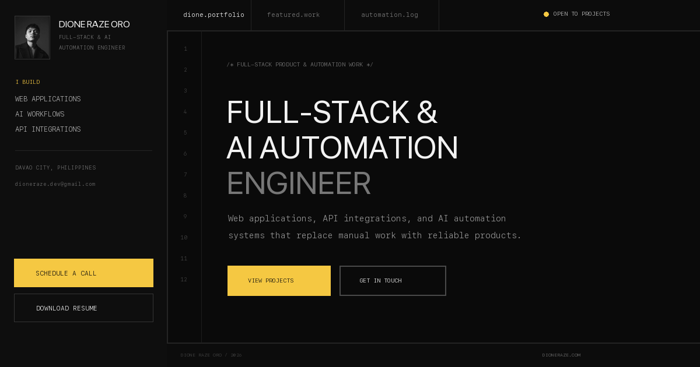

# Dione Raze — AI Automation + Full-Stack Portfolio

A responsive, monochrome editorial portfolio showcasing Dione Raze Oro's verified full-stack products, AI automation systems, writing drafts, tools, and project case studies.



## Live Demo

[View the portfolio](https://dioneraze.com/)

## Overview

The site uses a fixed personal sidebar on desktop and a full-screen navigation overlay on mobile. It preserves direct project routes, the portfolio assistant, command palette, theme controls, contact destinations, résumé download, and truthful project disclosures.

## Problem It Solves

A conventional résumé cannot clearly demonstrate how a developer approaches product problems, automation design, integrations, and implementation. This portfolio brings that evidence together in one accessible experience for clients, employers, and collaborators.

## Main Features

- Fixed minimal sidebar and responsive mobile navigation
- System, light, and dark themes with persisted explicit choices
- Featured full-stack products and AI automation case studies
- Blog architecture with published articles and clearly labeled draft records
- Verified gear, technology, capability, experience, and certification content
- Searchable command palette and accessible portfolio assistant
- Optional Supabase-backed presence and community chat
- Contact links, résumé download, and Calendly integration
- Reduced-motion, keyboard, focus-management, and responsive accessibility support

## Featured Products

### Migo

A mobile-first travel platform combining AI-assisted planning, trip organization, expenses, passport progress, community features, and travel memories.

[View Migo](https://migo-rust.vercel.app/)

### Laag Bukidnon

A responsive tourism platform that helps travelers discover destinations, find stays, access local guidance, and plan trips around Bukidnon.

[View Laag Bukidnon](https://laagbukidnon.vercel.app/)

## Technology Stack

- React 19
- TypeScript
- Vite
- Tailwind CSS
- Framer Motion
- Phosphor Icons
- Lucide React
- Supabase JS (optional community feature)
- Vercel

The portfolio also documents work involving n8n, Make, Zapier, Supabase, PostgreSQL, OpenAI, Claude, APIs, and related development tools.

## Screenshots

### Portfolio preview


## Installation and Setup

### Requirements

- Node.js 22 or later
- npm 10 or later

### Run locally

```bash
git clone https://github.com/dionerazedev/dione.works.git
cd dione.works
npm ci
npm run dev
```

Open `http://localhost:3000` in your browser.

The core portfolio does not require API keys. Without Supabase variables, `/community` and the sidebar presence indicator show an honest unavailable state and never fabricate viewers or messages.

### Optional community setup

1. Create a Supabase project.
2. Run [the community migration](supabase/migrations/20260727000000_community.sql) in the Supabase SQL editor or migration workflow.
3. Add these values to `.env.local`:

```bash
VITE_SUPABASE_URL=https://your-project.supabase.co
VITE_SUPABASE_ANON_KEY=your-anon-key
```

The migration creates persistent messages, reports, realtime publication, Row Level Security policies, and server-side cooldown/duplicate protection. Presence uses anonymous session IDs stored locally and exposes no IP address or precise location.

## Available Scripts

```bash
npm run dev        # Start the local development server
npm run lint       # Run ESLint
npm run typecheck  # Check TypeScript types
npm run test:e2e   # Run Playwright and axe browser tests
npm run build      # Create a production build
npm run preview    # Preview the production build
```

## Project Structure

```text
.
├── components/       # Shell, sections, community, projects, themes, and dialogs
├── data/             # Typed projects, blog posts, gear, navigation, and technology content
├── pages/            # Blog, gear, community, project, and not-found routes
├── supabase/          # Optional community database migration
├── tests/e2e/         # Responsive, interaction, route, and axe coverage
├── types/             # Shared project, command, and community models
├── public/           # Local images, SEO files, technology icons, and résumé
├── App.tsx           # Application shell
├── index.tsx         # React entry point
├── index.css         # Global styles
├── index.html        # Metadata and document shell
└── vite.config.ts    # Vite configuration
```

## Quality and Security

- API keys and credentials are not committed; community variables are optional.
- Environment files are excluded from version control.
- Type checking, linting, and production builds run in continuous integration.
- Reduced-motion preferences are respected across Framer Motion and CSS transitions.
- Viewer presence and community messages come only from Supabase Realtime when configured.

## Future Improvements

- Publish remaining blog drafts only after editorial review and adding real publication dates.
- Expand case studies only when additional architecture or outcome evidence is available.

## Contact

- Portfolio: [dioneraze.com](https://dioneraze.com/)
- Email: [dioneraze.dev@gmail.com](mailto:dioneraze.dev@gmail.com)
- LinkedIn: [Dione Raze Oro](https://www.linkedin.com/in/dione-raze-oro-b274a8243/)
- GitHub: [dionerazedev](https://github.com/dionerazedev)

---

Built by Dione Raze Oro.
